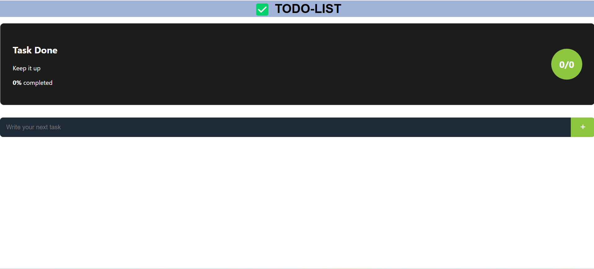
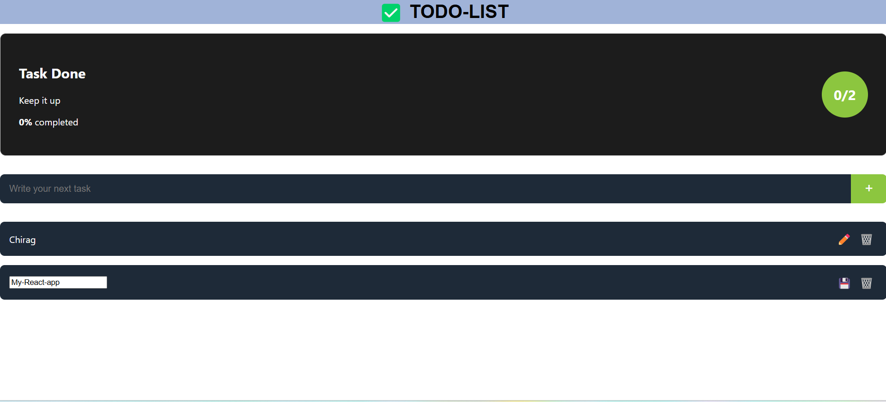

# 📝 To-Do List App

A simple and clean React-based To-Do List application with local storage support to manage your daily tasks efficiently.

## 🔧 Tech Stack
- React.js
- LocalStorage API
- HTML/CSS

## ✨ Features
- Add new tasks
- Edit and delete tasks
- Mark tasks as completed
- Track task completion percentage
- Tasks are saved using browser's localStorage
- Responsive and intuitive UI

## 🔗 Live Demo
👉 [todo-list-myreact-app-chirag.netlify.app](https://todo-list-myreact-app-chirag.netlify.app)

## 📸 Screenshot
<!-- You can upload a screenshot here later -->

## 📁 Folder Structure
- `App.jsx`: Main logic and layout
- `components/`: Contains all UI components like TaskInput, TaskList, TaskItem, StatsBox
- `styles.css`: All custom styles

## 🧠 Concepts Used
- useState, useEffect
- Passing props between components
- Lifting state up
- Controlled components
- localStorage for persistence

## 📬 Contact
**H M Chirag**  
📧 chiragshettyhm@gmail.com  
📍 Bengaluru, India
